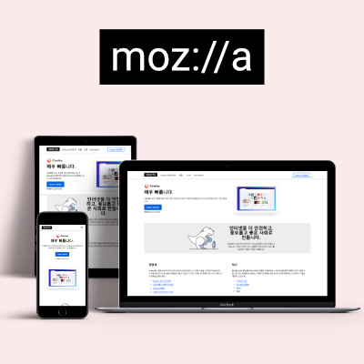

<!-- >#### 프로젝트에 사용한 모든 `호텔 관련 이미지의 저작권은 길조 호텔에 있음`을 알립니다. -->

# 프로젝트 - `moz://a` 

## 1. 프로젝트 간단 요약

`반응형` 웹페이지 퍼블리싱.  
본인 기여도 : `100%`

기존의 반응형 웹페이지를 모방해 퍼블리싱한 프로젝트. 

---

## 2. 프로젝트에 사용한 Tools

- Design
  - `Adobe PhotoShop`
- Publishing
  - `Visual Studio Code `  

---

## 3. 프로젝트 컨셉 & 주요 목표

1. `그리드 시스템` 사용
2. `반응형 웹페이지`로 제작
3. 그대로 모방하며 기존 사이트 `구조 분석`
